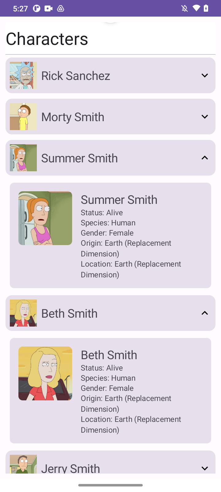
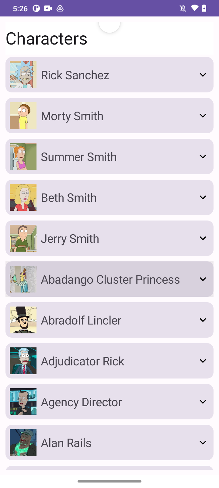

# Android-Test-App
### Project Overview

This project is an Android application built with Kotlin and Jetpack Compose. It utilizes modern Android development practices and architecture components to create a simple character browsing app. Below is an overview of the project's architecture, functionality, and key components.

### Architecture

The project follows the MVVM (Model-View-ViewModel) architecture pattern:

- **Model**: Represents the data and business logic of the application. It includes data classes, repositories, and data sources.
  
- **View**: Represents the UI components of the application. It includes Jetpack Compose UI components and layouts.
  
- **ViewModel**: Acts as a mediator between the Model and the View. It holds the UI-related data and provides data to the View components.

### Key Components

- **CharacterListScreen**: This composable function displays a list of characters fetched from the API. It uses Jetpack Compose's `LazyColumn` to efficiently display large data sets.

- **CharacterViewModel**: Manages the UI-related data and business logic. It communicates with the repository to fetch data from the API or local database.

- **CharacterRepository**: Handles data operations, including fetching data from the API and storing/retrieving data from the local Room database.

- **CharacterDatabase**: Provides a local Room database to store character data offline.

- **NetworkUtils**: A utility class to check network connectivity and determine whether the device is online or offline.

### Functionality

1. **Fetching Characters**: The app fetches characters from an external API using Retrofit. It displays the characters in a scrollable pull to refresh list.
  
2. **Pagination**: Characters are fetched in pages, allowing the user to scroll infinitely to load more characters.

3. **Offline Support**: The app stores fetched characters locally using Room database. If the device is offline, it retrieves characters from the local database instead of making network requests.

### Screenshots

### How to Run

To run the project:

1. Clone the repository to your local machine.
2. Open the project in Android Studio.
3. Build and run the project on an emulator or physical device.

### Dependencies

The project uses the following dependencies:

- Retrofit for network requests.
- Gson for JSON parsing.
- Coil for image loading.
- Jetpack Compose for building UI.
- Material Components for UI design.
- Room for local database storage.

